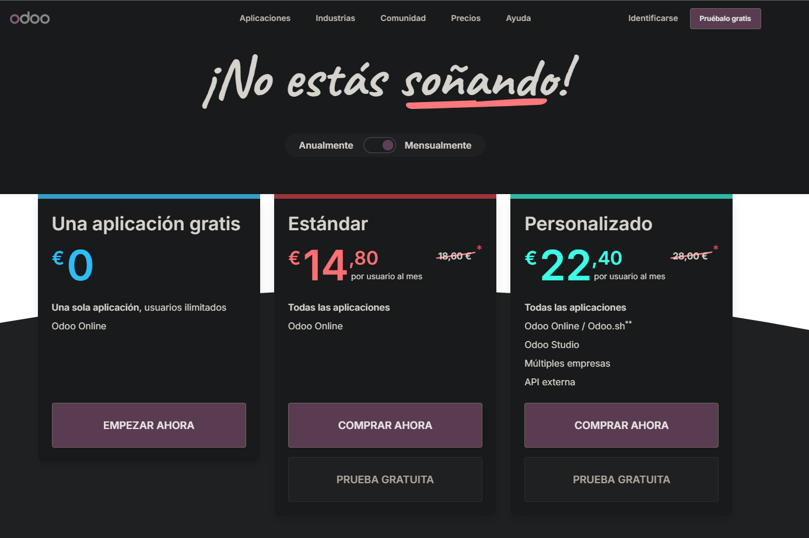
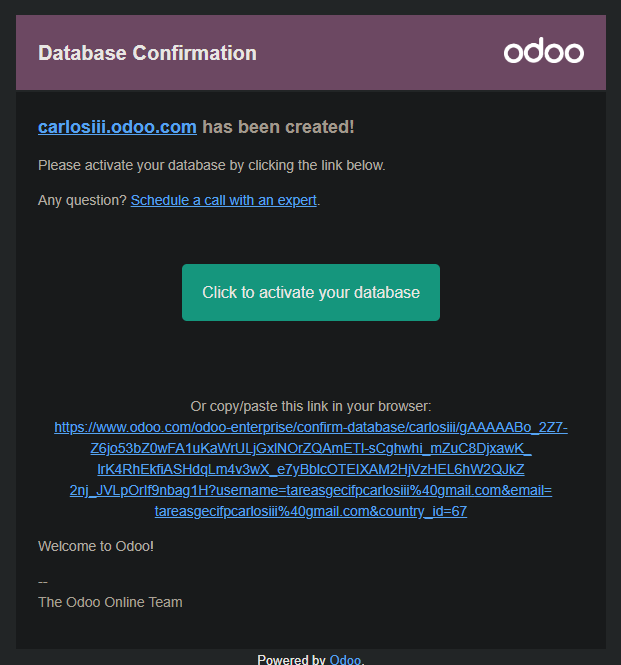
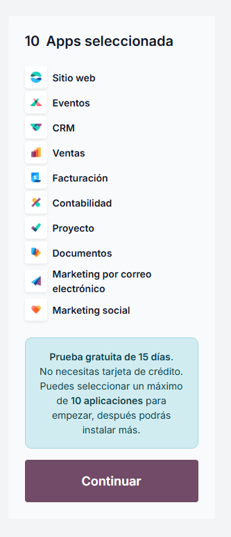
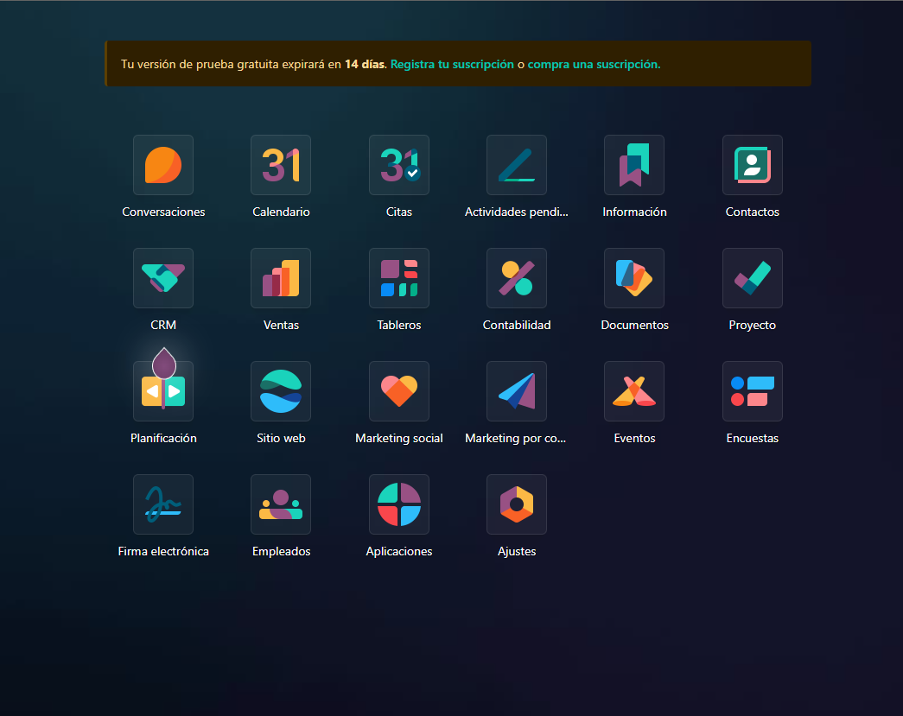

# 03 — Instalación y prueba (15 días) / Alta e instalación de apps

## Requisitos de la Instalación

- Navegador moderno y actual
- Cuenta de correo para el alta

## Pasos para la Instalación

1. Acceder a la web de Odoo y solicitar el plan acorde en este caso la prueba de 15 días del estándar (IMPORTANTE DEBEMOS ACTIVAR LA BASE DE DATOS DESDE EL CORREO)

> Activamos la base de datos desde Gmail

2.  Seleccionamos los módulos que queramos o que creamos pertinentes como máximo 10

3. Instalación y desinstalación de aplicaciones de Odoo

> Mediante el icono de aplicaciones del menú de inicio podemos acceder a un amplio catalogo de aplicaciones y desinstalar las que ya tengamos pulsando en los tres puntitos que aparecen junto a la app (Cuidado con los datos al desinstalar una app)

## Resultado esperado

