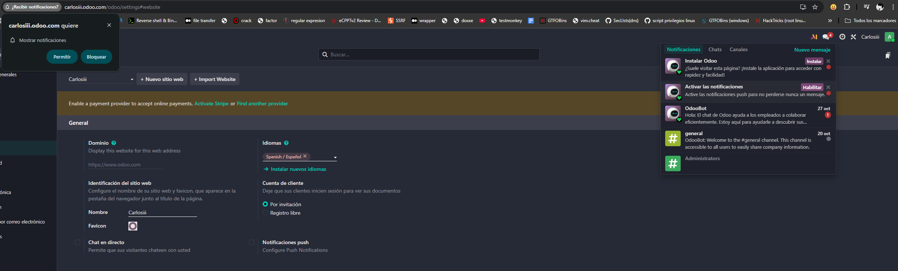
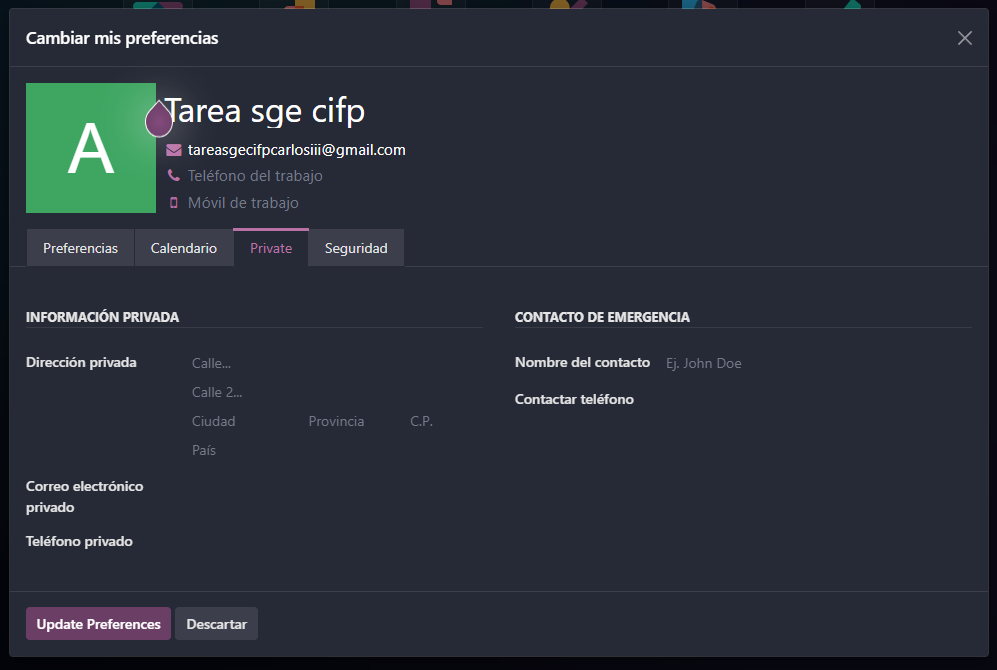
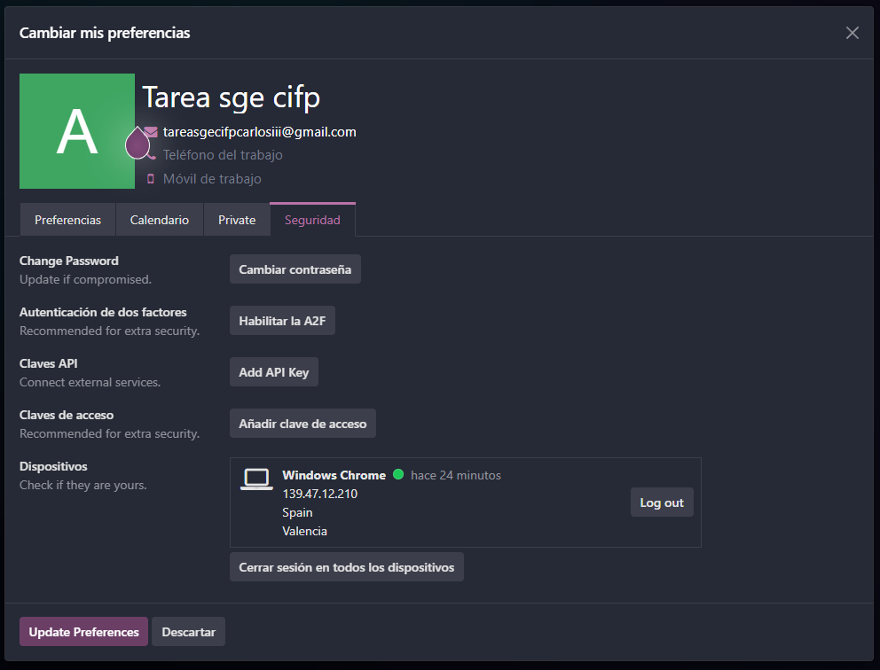
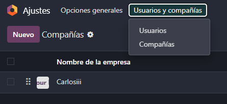
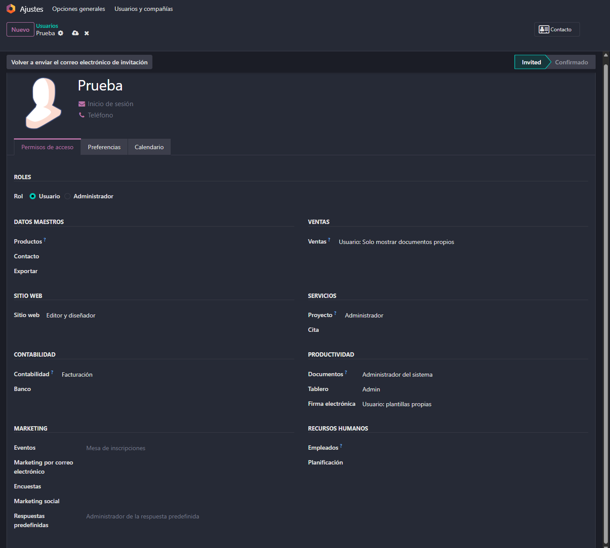
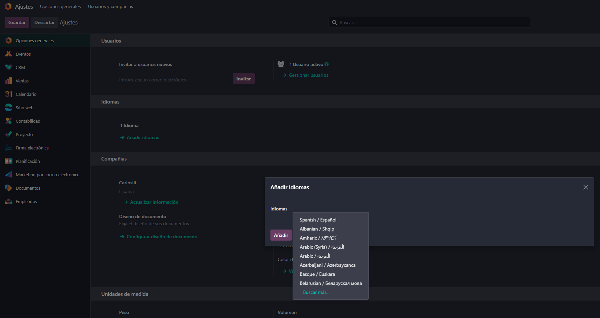
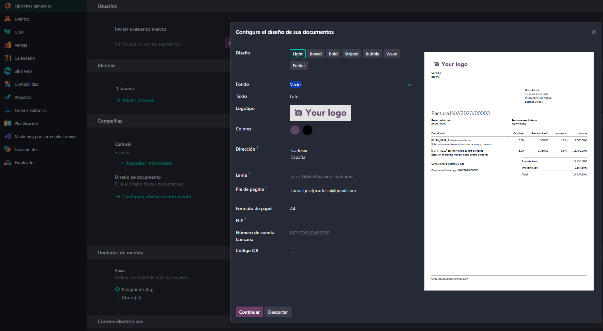
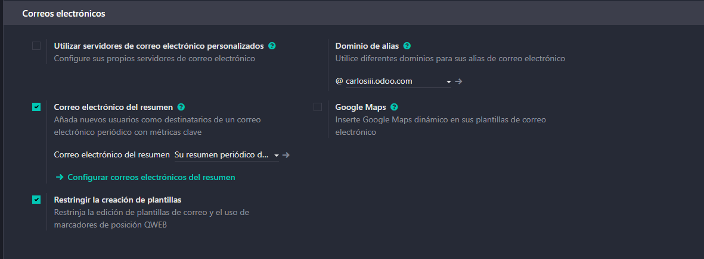
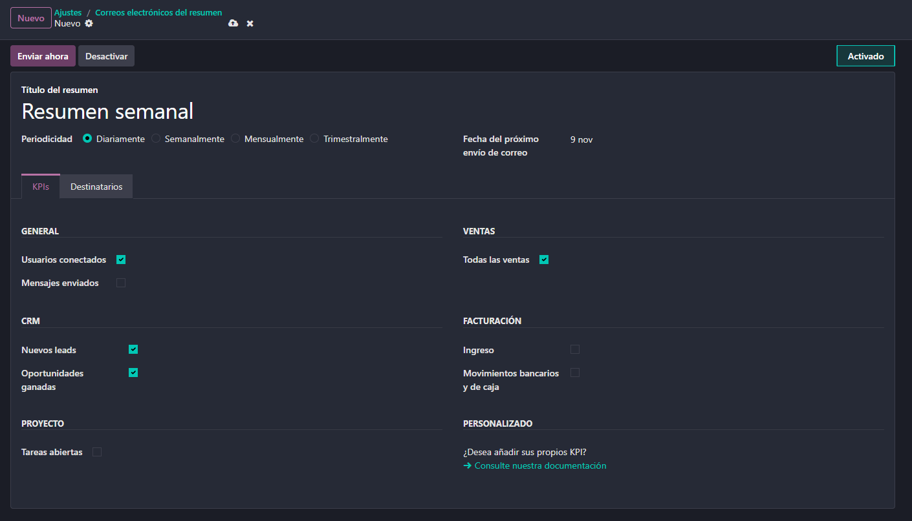

# 04 — Ajustes generales

## Activación de notificaciones
Importante activar las notificaciones para estar al tanto de la aplicacion de Odoo

## Ajustes de perfil
Clickando en la esquina superior derecha tendremos acceso a configurar distintas cosas de nuestro perfil

### Preferencias
En la pestaña de preferencias podemos establecer el modo oscuro, la firma del email y las notificaciones en Odoo

### Datos
En la pestaña de private como en la de calendario y tambien en la parte de arriba donde sale nuestro nombre y correo podemos modificar nuestros datos

### Seguridad
En la pestaña de seguridad podemos habilitar el doble factor de autenticación (2FA)

## Ajustes de usuarios y compañias
 
Desde ajustes en la esquina suiperior derecha encontramos un apartado para gestionar nuestras empresas por modulos y nuestros usuarios por permisos y roles

Este sería un ejemplo de un usuario a crear

>  Importante a tener encuenta que en Odoo Enterprise se paga por usuario mientras que en la version Community no.

## Ajustes de idiomas y diseño de documentos
Desde la aplicacion de ajustes (ajustes generales) podemos gestionar los idiomas y el diseño de documentos

### Idiomas
Podemos añadir varios idiomas

### Diseño de documentos
Dentro de los ajustes generales en el apartado de compañía podemos modificar las plantillas de los documentos como las facturas

## Ajustes de emails de resumen
Desde los ajustes generales podemos configurar los emails de resumen, su periodicidad y los destinatarios

Así se vería un ejemplo de configuración de los emails de resumen

