# 05 — Integración con Gmail (OAuth GCP + Add-on)

## Activar plugin de correo en Odoo
Importante: este paso es necesario para que Odoo pueda gestionar la integración con Gmail u outlook
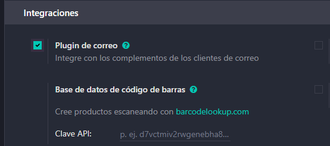

Podemos instalar desde nuestro correo de Gmail la extensión oficial de Odoo para Gmail, que nos permitirá crear contactos y oportunidades directamente desde el correo
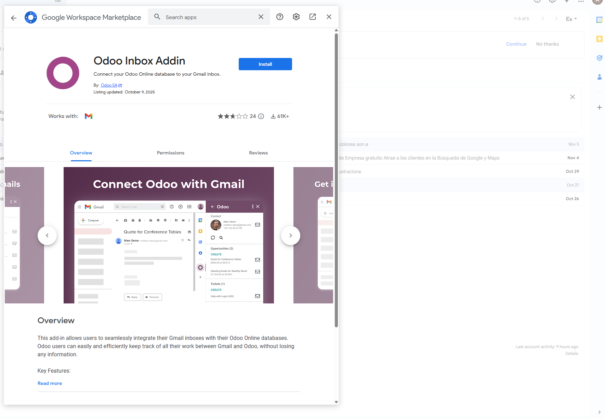

Una vez instalado, nos aparecerá un icono de Odoo en la barra lateral derecha de Gmail
Haciendo clic en el icono, se nos abrirá el add-on de Odoo en Gmail
Debemos iniciar sesión y conectar con la base de datos de Odoo
Una vez conectado podemos ver información de la empresa o contactos que nos hayan enviado un correo, asi como crear nuevos contactos u oportunidades directamente desde el correo
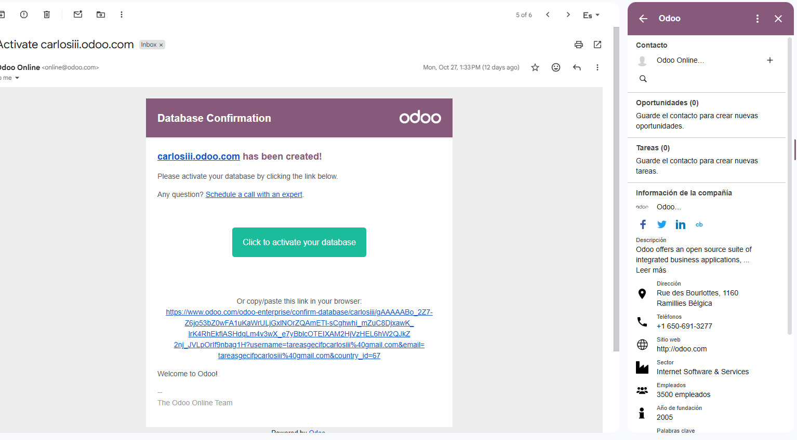

## Oauth
Debemos activar la integración de autenticación OAuth en Odoo en los ajustes generales

Posteriormente nos saldrá la opción de configurar los proveedores OAuth
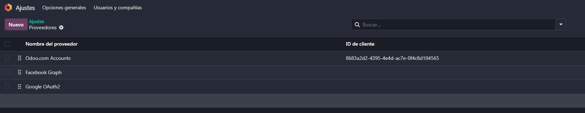

En este caso, vamos a configurar el proveedor de Google
Para ello necesitaremos acceder a Google cloud console y crear un proyecto
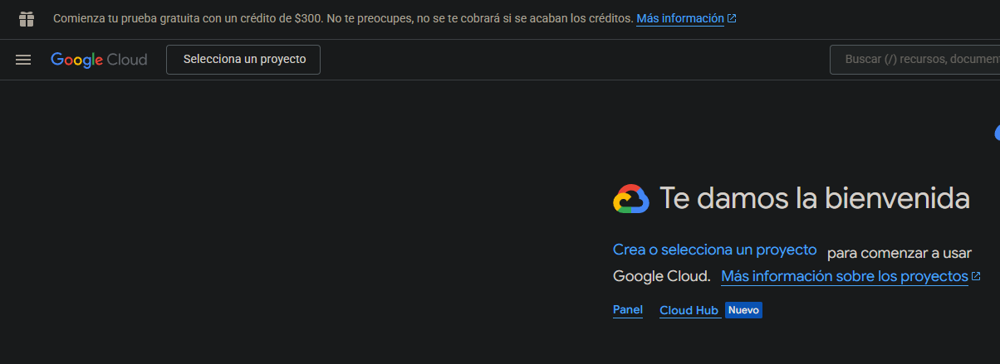

Buscamos en la parte superior ""Gmail API"" y la habilitamos
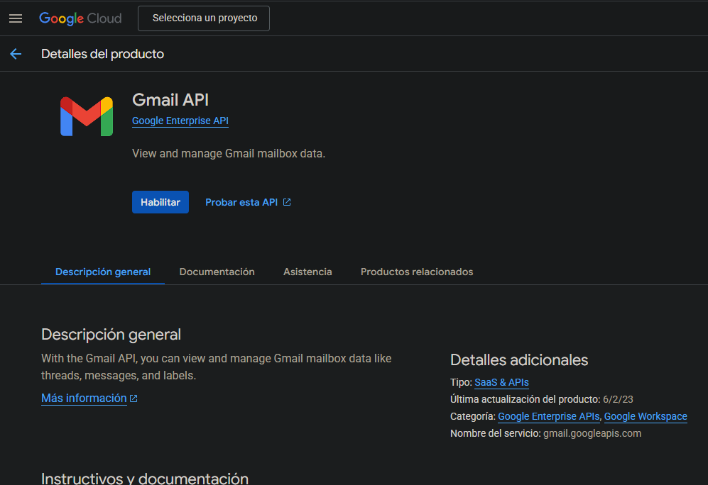

Una vez habilitada debemos crear las credenciales
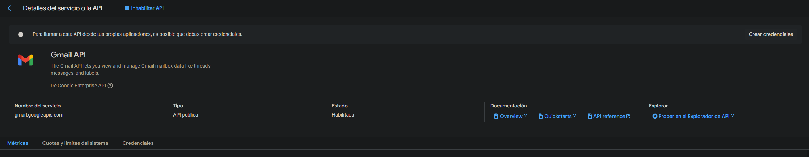

Selecionamos la api y los datos de usuario
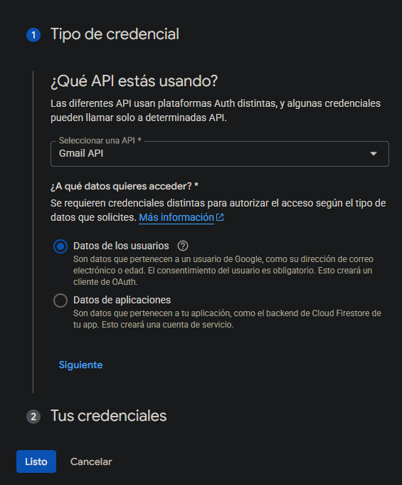

En el siguiente paso rellenamos datos de la aplicación y introducimos el correo

Continuando con el siguiente paso, debemos configurar los permisos de odoo
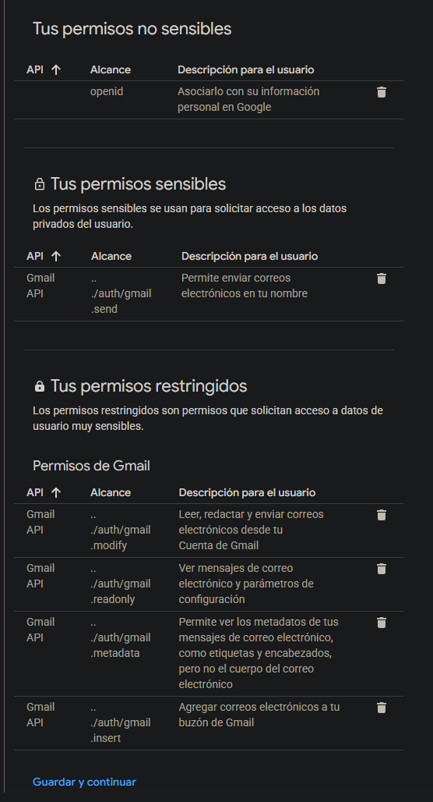

Y por último, debemos configurar la URI de redirección asi como el ID del cliente de Oauth, deberemmos especificar que es una aplicación web junto con el nombre y la URI de redirección si no la colocamos bien no funcionará
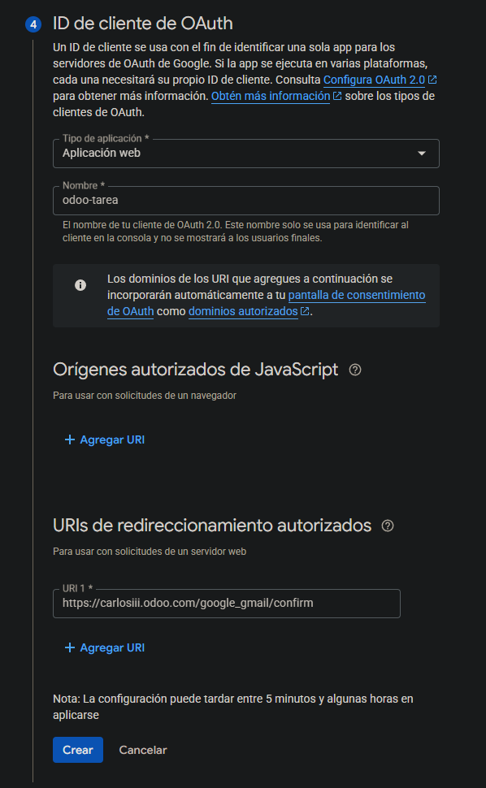

Una vez creado en el panel izquierdo de credenciales, podemos ver el ID y el secreto del cliente
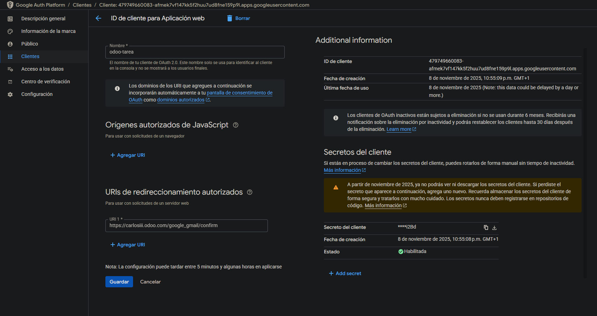

Y debemos copiar estos datos en Odoo en la configuración del servidor de correo de Gmail
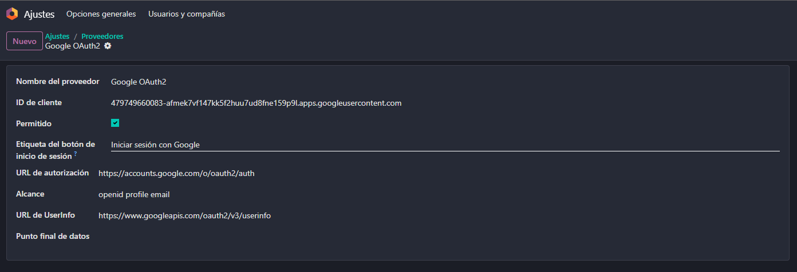

Finalmente en ajustes generales activamos utilizar servidores de correo electrónico personalizados y se muestra la opcion de usar un servidor de correo de Gmail en el cual proporcionamos el ID y el secreto del cliente
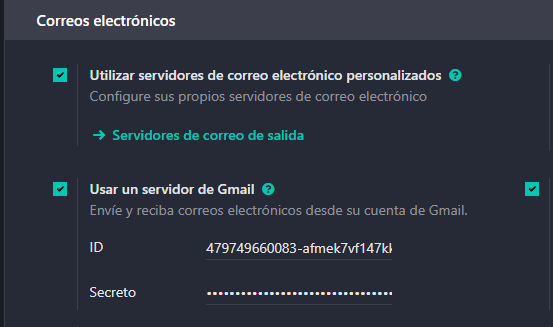