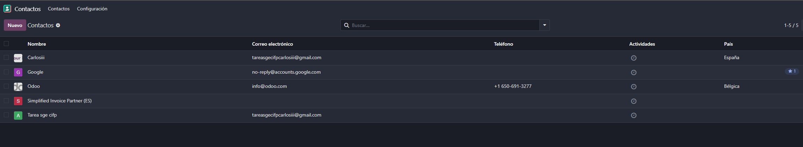
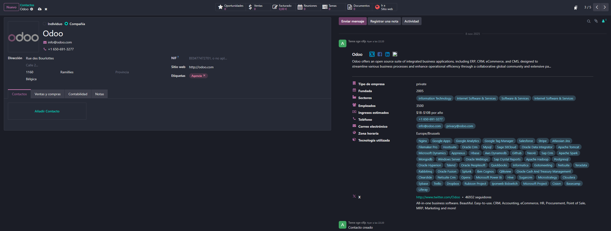
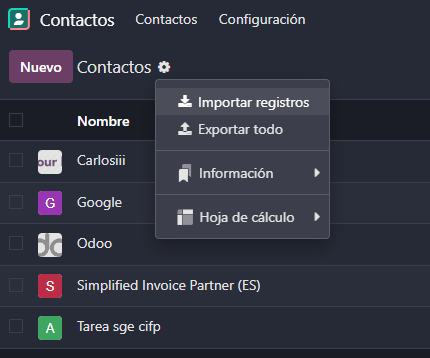
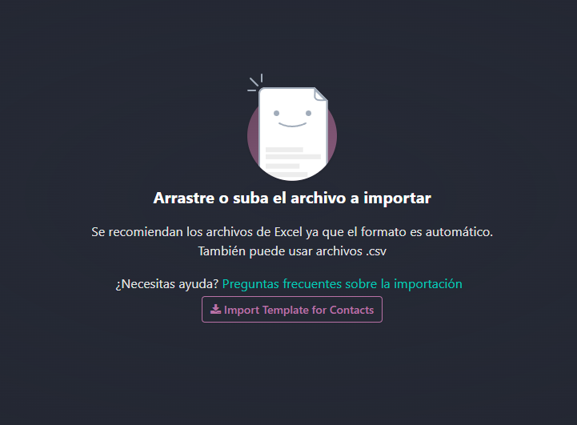
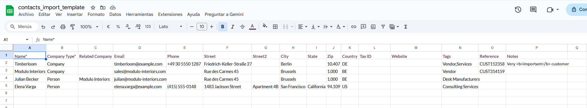

# 06 — Contactos

## Contactos y Empresas
Odoo permite gestionar tanto contactos individuales como empresas.
Para ello, en nuestro panel de aplicaciones, seleccionamos el módulo de contactos

## Etiquetas en Contactos
Dentro del módulo de contactos, podemos ver una lista de todos los contactos que tenemos registrados en nuestro sistema, así como ver la empresa asociada a cada contacto, si clickamos sobre un contacto podemos ver toda la información sobre él y la empresa a la que pertenece incluso podemos asignarle etiquetas para segmentarlos mejor

> Podemos crear nuevas etiquetas desde configuración > etiquetas de contacto en el panel superior

> Desde los contactos podemos cambiar entre distintas vistas que nos permiten clasificar los contactos por geolocalización, por tareas y en el panel superior por etiquetas, y dentro de cada contacto podemos configurar el modulo de ventas y compras y contabilidad y tambien establecer una nota orientativa sobre el mismo

## Importación de Contactos
Desde nuestro panel de contactos podemos importar registros en formato excel o csv

Nos descargamos la plantilla para rellenar los contactos

En la propia plantilla ya nos vendrían algunos ejemplos de como rellenar los campos
