# 07 — Calendario y Citas

## Calendario

En el panel de aplicaciones, seleccionamos el módulo de Calendario para poder ver y gestionar nuestras citas y reuniones con vista diaria, semanal o mensual

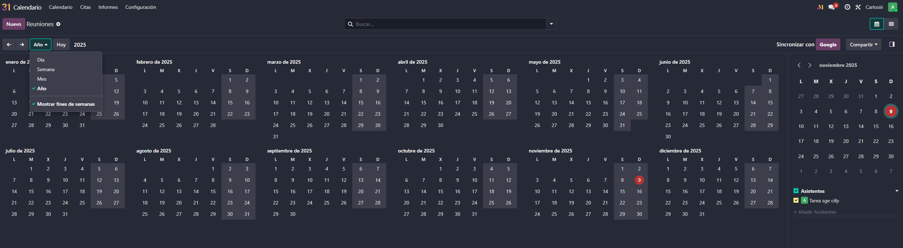

### Integración con Google Calendar
Para integrar nuestro calendario de Odoo con Google Calendar, debemos ir a google cloud console y crear otro proyecto nuevo

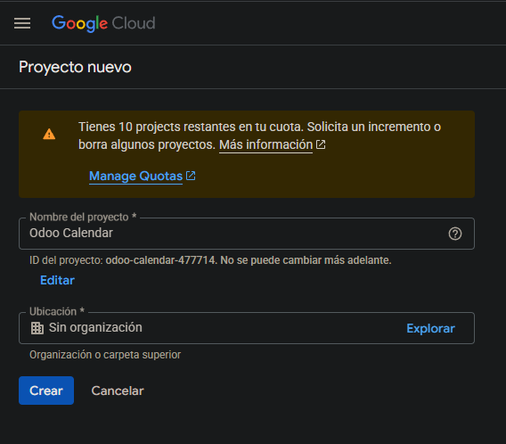

Buscamos en la parte superior "Google Calendar API" y la habilitamos
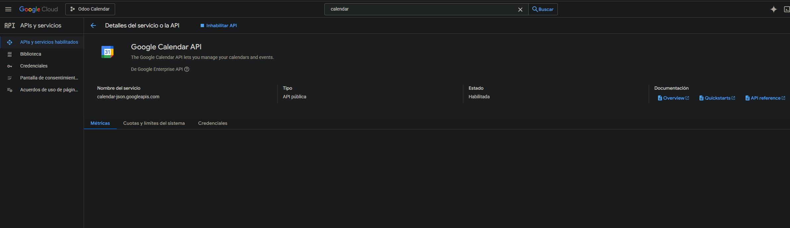

Una vez habilitada debemos crear las credenciales para ello seguimos el mismo proceso que en el paso 5, hasta llegar al paso 3 de los permisos
- [Credenciales](05-integracion_gmail.md#credenciales)

Cuando lleguemos al paso 3, selecionaremos el permiso openid y todos los permisos de Google Calendar API, siguiendo con el paso 4 donde seleccionaremos aplicación web y rellenaremos los datos de nombre y URI de redirección 
>**Importante colocar la URL correctamente**

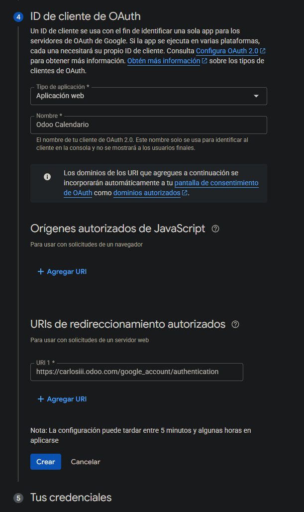

Y como está explicado en el paso 5 ya tendremos el ID y el secreto el cual debemos copiar en Odoo en la configuración de Google Calendar en el apartado de calendario en los ajustes
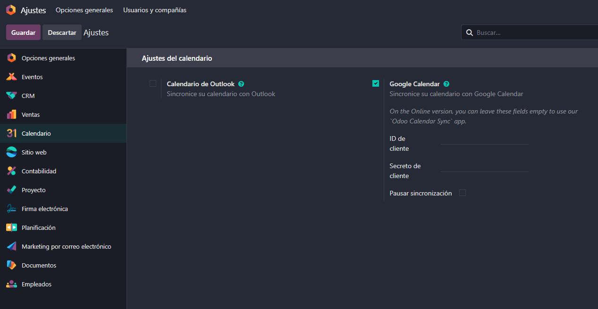

### Odoo Meet
Habiendo configurado Google calendar podemos crear reuniones desde Odoo calendar, donde incluso podremos proporcionar un enlace de una reuinión de zoom o meet o usar Odoo meet para crear una videollamada directamente desde Odoo, para ello clickamos sobre el dia y se nos abarirá un desplegable donde en mas opciones podemos configurar la reunión y activar la opción de odoo meet
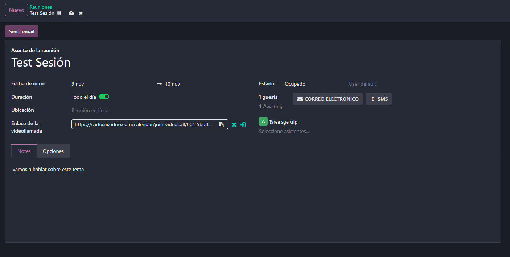

Accediendo al enlace o clickando en el icono que aparece al lado podremos unirnos a la videollamada
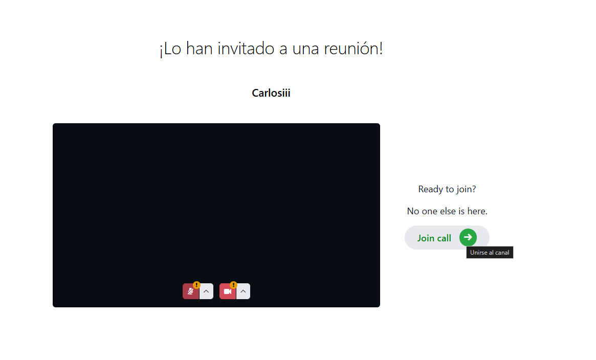

## Módulo Citas (Enterprise)
Odoo cuenta con un módulo de citas muy potente que nos permite generar un enlace para que nuestros clientes puedan reservar citas
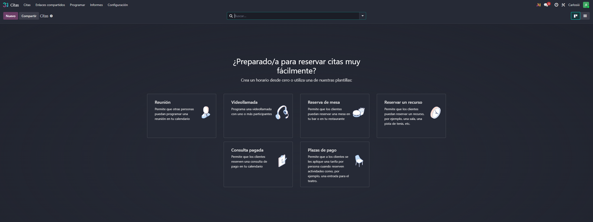

Al crear una cita podemos modificar distintos detalles entre ellos:
- Preguntas previas
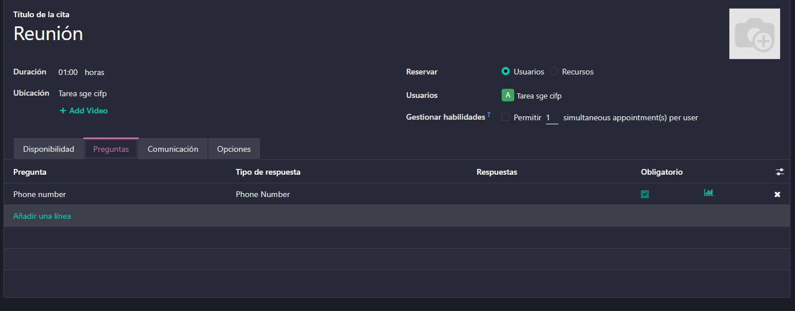
- Configurar buffers entre citas
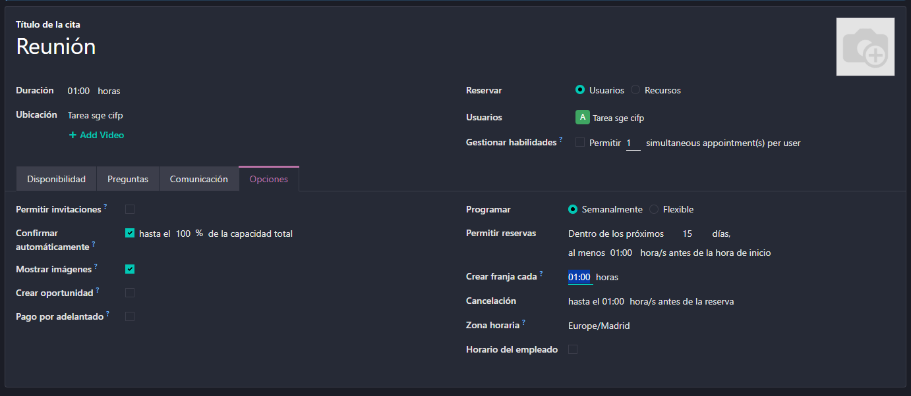

Continuando, en la esquina superior izquierda nos saldra un boton para compartir el enlace de la cita
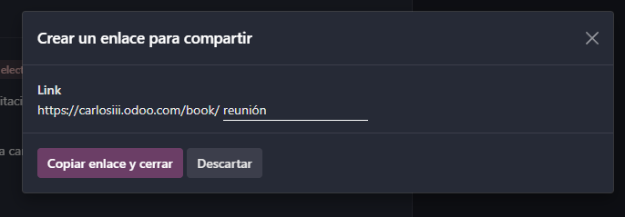

Al abrir el enlace el cliente (o nostros mismos para probar) podra ver la disponibilidad del equipo y reservar una cita en el horario disponible
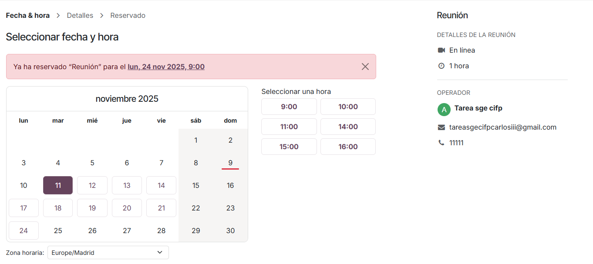

Al clickar en un horario disponible, se nos abrirá un formulario para rellenar los datos de la cita y despues veremos la cita programada, donde el usuario podra añadirla a su calendario de google o outlook (en este caso usaremos google calendar para probar)
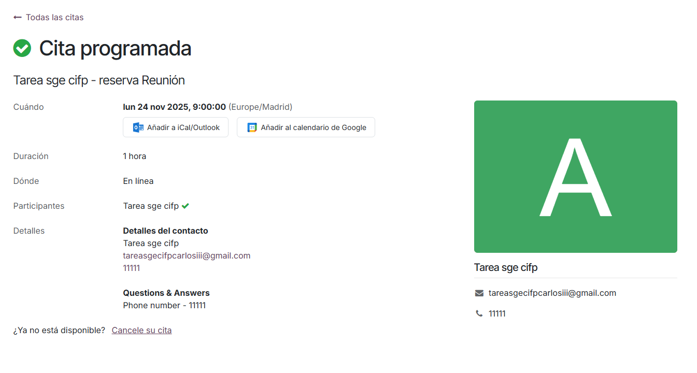

Ahora podemos volver al calendario de Odoo y ver que la cita ya aparece en nuestro calendario
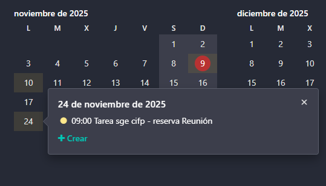

