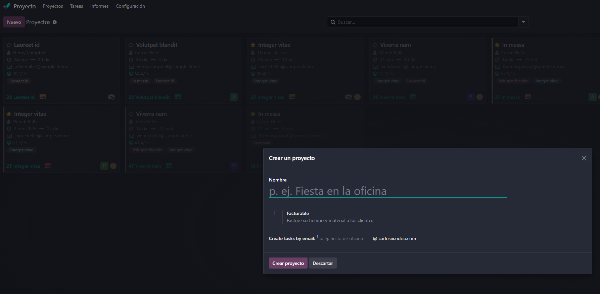
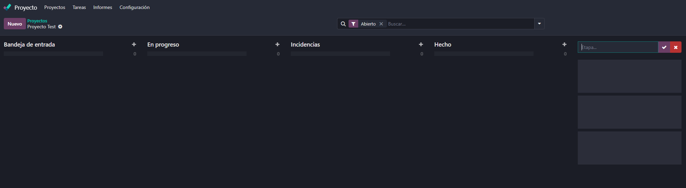
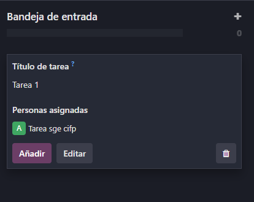
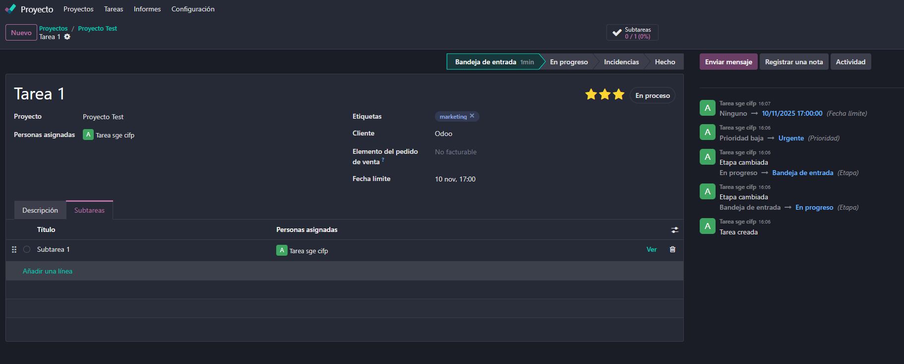
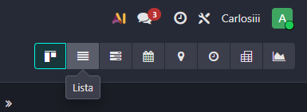
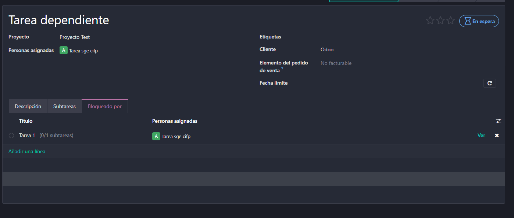
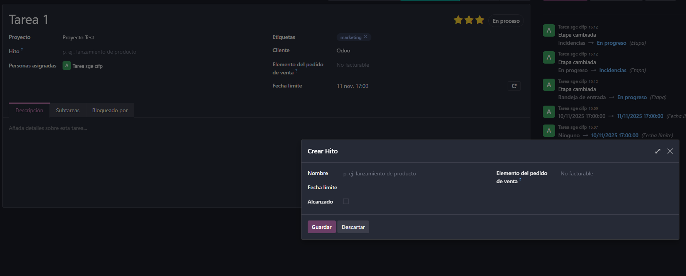
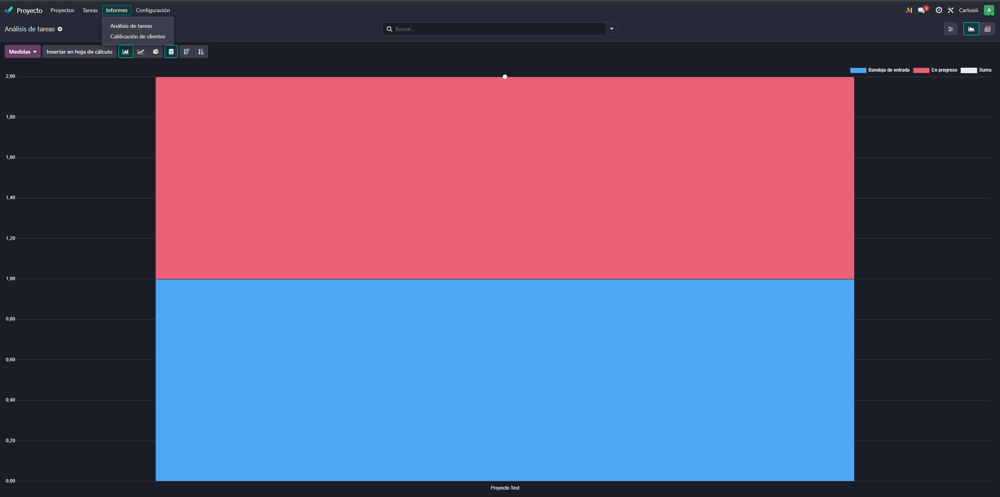

# 08 — Proyectos (Kanban)

## Módulo Proyectos
En el panel de aplicaciones, seleccionamos el módulo de Proyectos para gestionar nuestros proyectos y tareas

En la esquina superior izquierda podemos crear nuevos proyectos (en este caso uno de prueba) despues podremos ponerle nombre y asignar facturación y el cliente a facturar

Una vez creado podremos establecer las etapas del proyecto

Dentro de cada etapa podremos crear tareas y asignarlas, y posteriormente editarlas

Dentro de la edicion de la tarea podemos establecer etiquetas, prioridadades, clientes, fecha limite, personal asignado, y un registro de las actividades realizadas etc, en el apartado de subtareas podremos crear subtareas asi como mostrar mas datos de la misma (se pueden crear subtareas dentro de subtareas)

### Vistas
En la esquina superior derecha podemos alternar entre distintas vistas de las tareas del proyecto de las cuales destacan, kanban (por defecto), lista y calendario

### Tareas Recurrentes
Al clickar en nuestro proyecto en la seccion de ajustes veremos la opcion de tareas recurrentes la cual habilitaremos

Al hacer esto podemos editar las tareas y nos saldra la opcción de hacerla recurrente

### Tareas Dependientes
En el mismo menú anterior podemos habilitar la opción de tareas dependientes

Ahora si vamos a una tarea, veremos la pestaña "bloqueado por" la cual podemos establecer la tarea de la que depende

### Hitos
Dentro del menú de ajustes del proyecto, podemos habilitar la opción de hitos

Despues se nos habilitará la opcion de añadir hitos en una tarea

### Calificación del Cliente y Registro de Actividades

Dentro del proyecto podremos ver en la parte superior la pestaña de Informes donde podremos (tanto nosotros como el cliente) llevar un seguimiento de los Análisis de las tareas y la calificación de los clientes
