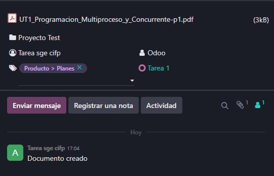
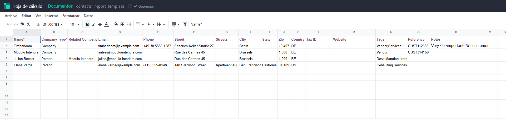
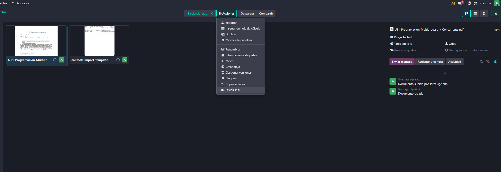
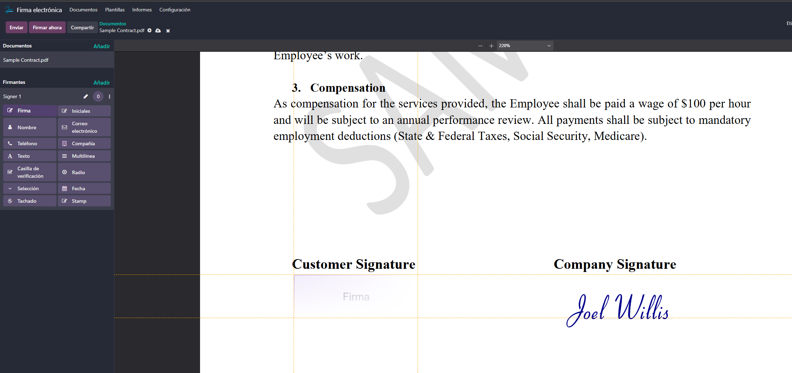
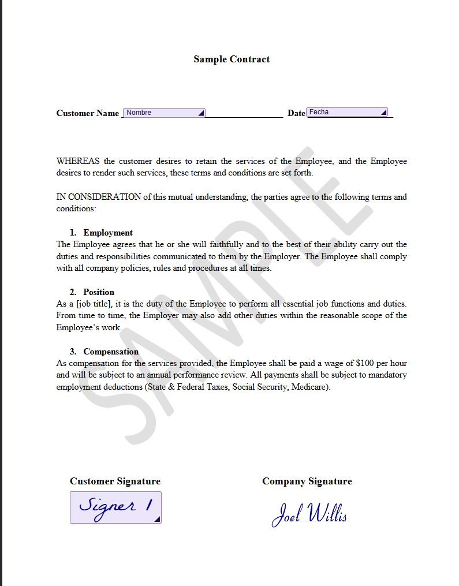
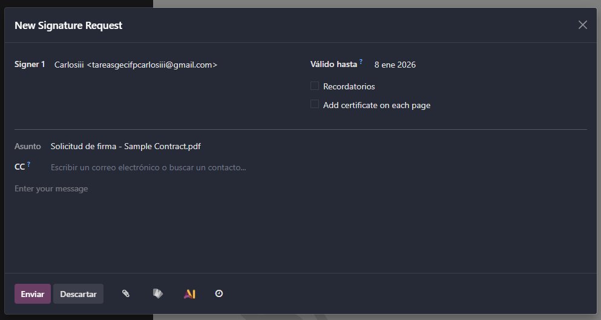
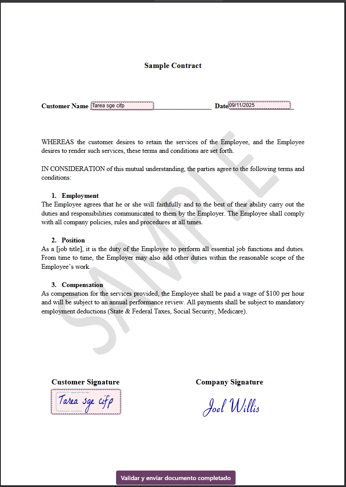
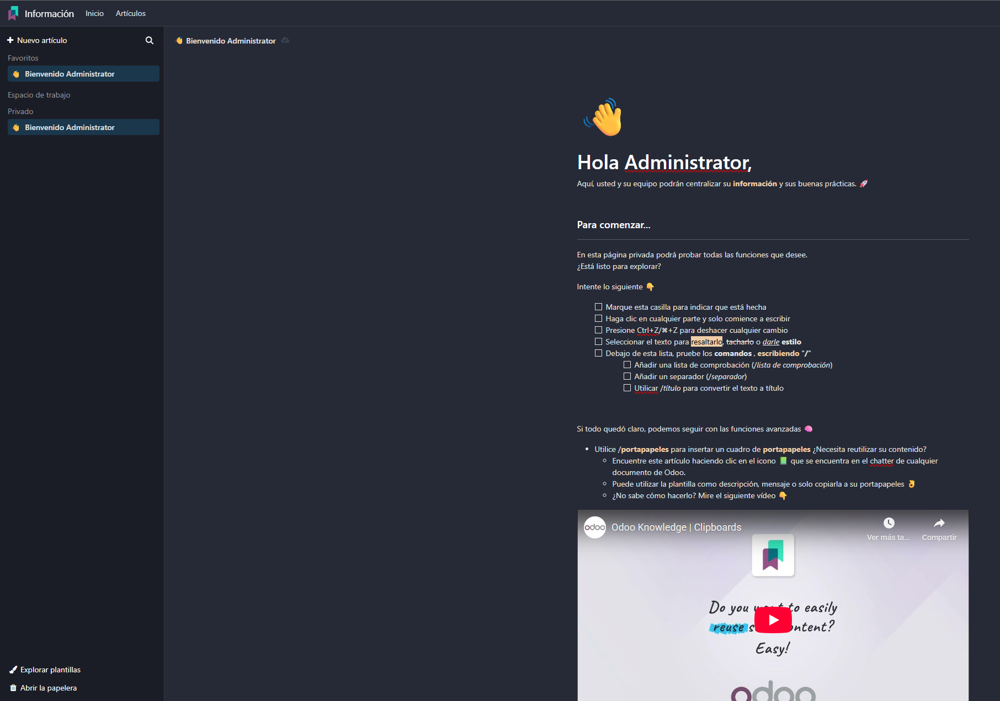
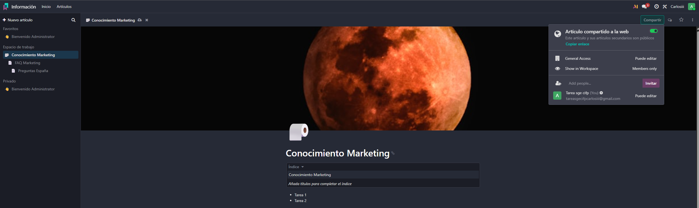

# 09 — Documentos, Firma e Información (Knowledge)

## Módulo Documentos

En el panel de aplicaciones, seleccionamos el módulo de Documentos para gestionar nuestros archivos y documentos, podemos ver que se organiza por carpetas, subimos un archivo arrastandolo

> Podemos modificar distintos ajustes del archivo al clickarlo, como las etiquetas y el flujo, en un panel lateral derecho que se abre 

### Edición de Hojas de Cálculo
Al intentar abrir un excel se nos da la opción de abrirlo con Odoo hojas de cálculo, al abrirlo podemos editarlo directamente desde Odoo

### Dividir PDFs
Al seleccionar un archivo PDF, en el menú superior nos aparece la opción de dividir el PDF en varias partes

## Módulo Firma Electrónica
Odoo cuenta con un modulo de firma electrónica el cual se integra bien con el módulo de documentos, en este caso usamos el documento de prueba para firmar

Colocamos con el panel izquierdo los campos que queremos que sean rellenados

Y posteriormente enviamos el documento para firmar en el boton de arriba a la izquierda

Al abrirlo es tan sencillo como clickar en los campos y se rellenan, quedaria tal que así

Y ya nos aparecería en el módulo de firma electrónica el documento firmado

## Módulo Información (Knowledge)
Odoo cuenta con un módulo de información tipo wiki, el cual nos permite crear páginas de información interna para la empresa

Podemos crear en nuestro espacio de trabajo nuevas páginas y subpáginas y construir una wiki al estilo Notion, en el boton de arriba a la derecha que dice compartir podemos gestionar los permisos de la página y compartirla.
