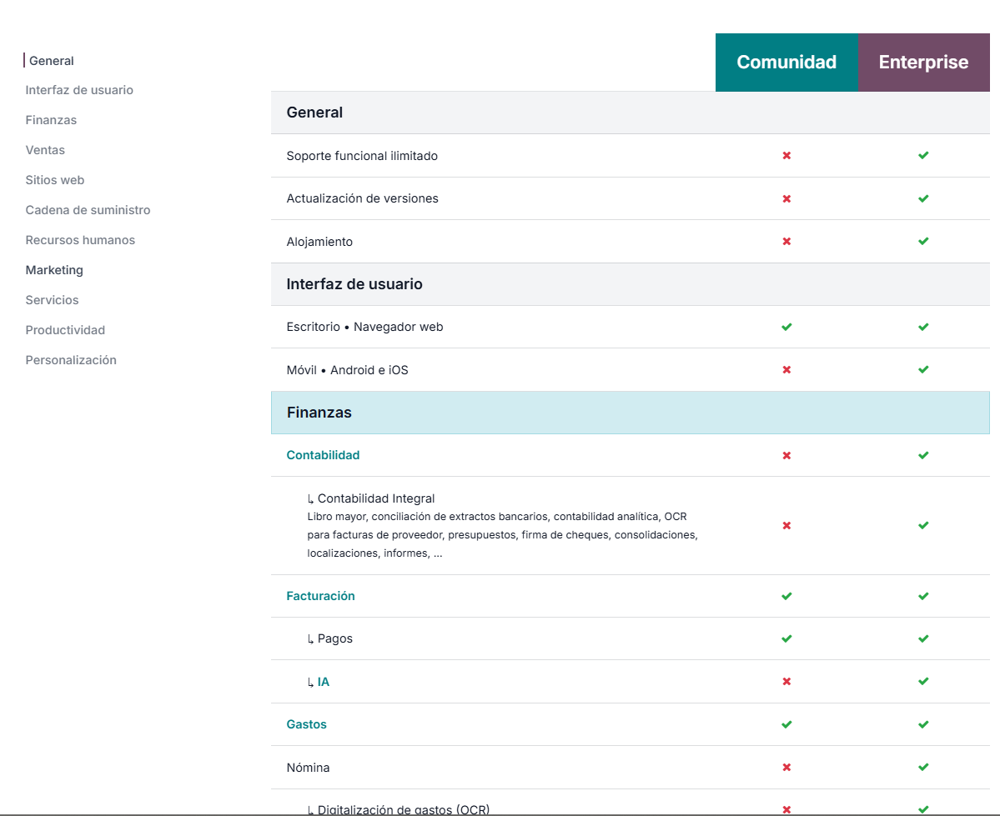

# 10 — Ediciones y costes

## Principales diferencias entre Community y Enterprise
En la propia web de odoo podemos ver las diferencias entre ambas ediciones

- [Comparación de Ediciones](https://www.odoo.com/es_ES/page/editions)

En resumen sabemos que la edición community es gratuita y open source, pero no cuenta con soporte oficial ni actualizaciones automáticas lo que supone un riesgo de seguridad y conlleva un mantenimiento mas complejo y costoso, mientras que la edición enterprise cuenta con soporte oficial, actualizaciones automáticas y acceso a nuevas funcionalidades y módulos exclusivos de esta edición, además de contar con una app móvil oficial.

Vease también:
- [Introducción y comparación de ediciones](02-introduccion.md)

## Precios con Odoo Enterprise
Odoo enterprise nos cobra por usuario y nos da a elegir entre cobro mensual o anual, siendo el anual más económico

**Importante**:
> El contrato es anual aunque el pago sea mensual

**Tabla de precios:**
| Edición | Coste por usuario (mensual) | Coste por usuario (anual) |
| -------- | -------------------------- | ----------------------- |
| Estandar     | 14,80 €                       | 11,90 €                  |
| Personalizado    | 22,40 €                       | 17,90 €                  |

Odoo nos ofrece una prueba gratuita de 15 días de la version enterprise con un máximo de 10 aplicaciones.