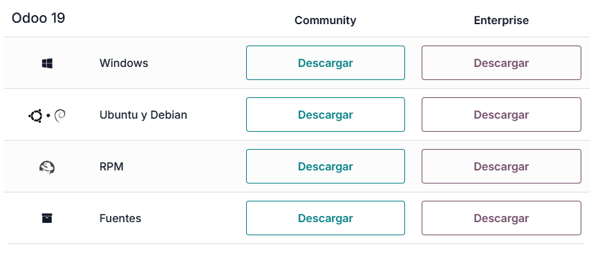
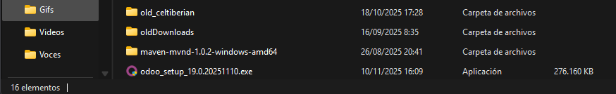

# 03 — Descarga del instalador de Odoo

Para descargar odoo accedemos al siguiente enlace y rellenamos los datos de nuestra empresa:
- [Web oficial para descarga de Odoo](https://www.odoo.com/es_ES/page/download)

Despues nos desplazamos hasta abajo para elegir la version de windows para descargar

En este caso escogeremos la versión 19.0 community de windows, pero podemos optar por una mas moderna o estable si aplica.

---------------------------
Una vez descargado lo tendriamos en nuestra carpeta de descargas por defecto y se veria algo asi:
