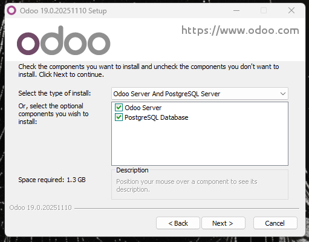

# 04 — PostgreSQL en Windows

1. Comprueba que el **servicio de PostgreSQL** está en ejecución.

> Resultado esperado: PostgreSQL instalado y funcionando (usuario/puerto guardados).

El instalador de Odoo 19 para windows ya nos incluye PostgreSQL por lo que podemos ver en el [paso 5](05-instalacion_odoo.md).

> Foto de referencia del siguiente paso para mostrar que PostgreSQL se instala junto a Odoo.

Durante la instalación podremos configurar el usuario y la contraseña
