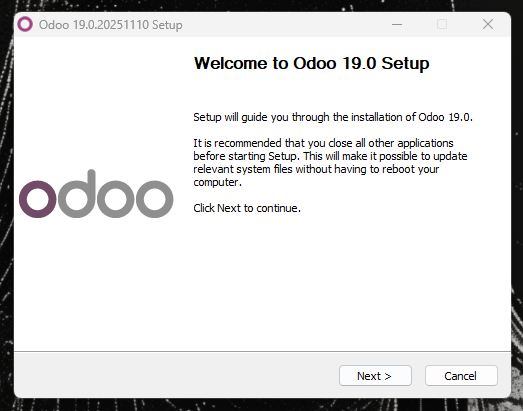
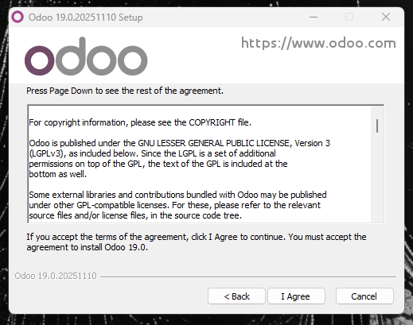
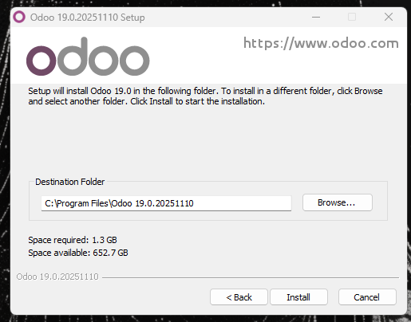
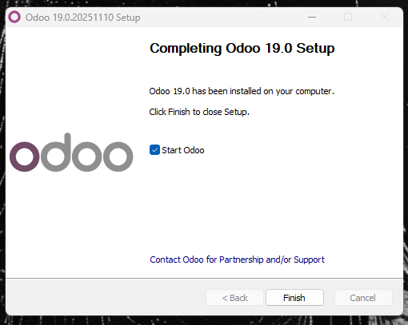

# 05 — Instalación de Odoo

Abrimos el instalador que descargamos en el [paso 3](03-descarga_instalador.md) y nos aparecera el asistente de instalacion de Odoo.

Pulsamos siguiente y aceptamos los terminos de la licencia.

Despues nos pedirá el tipo de instalación seleccionaremos odoo server y postgresql y pulsamos siguiente.

Despues nos pedirá la ruta de instalación, podemos dejar la que viene por defecto o cambiarla, una vez decidido pulsamos siguiente y solo quedará esperar.

Finalmente una vez completada pulsaremos siguiente y ya finalizaremos la instalación.

Podremos acceder a Odoo en la siguiente URL:
- [localhost:8069](http://localhost:8069/)
