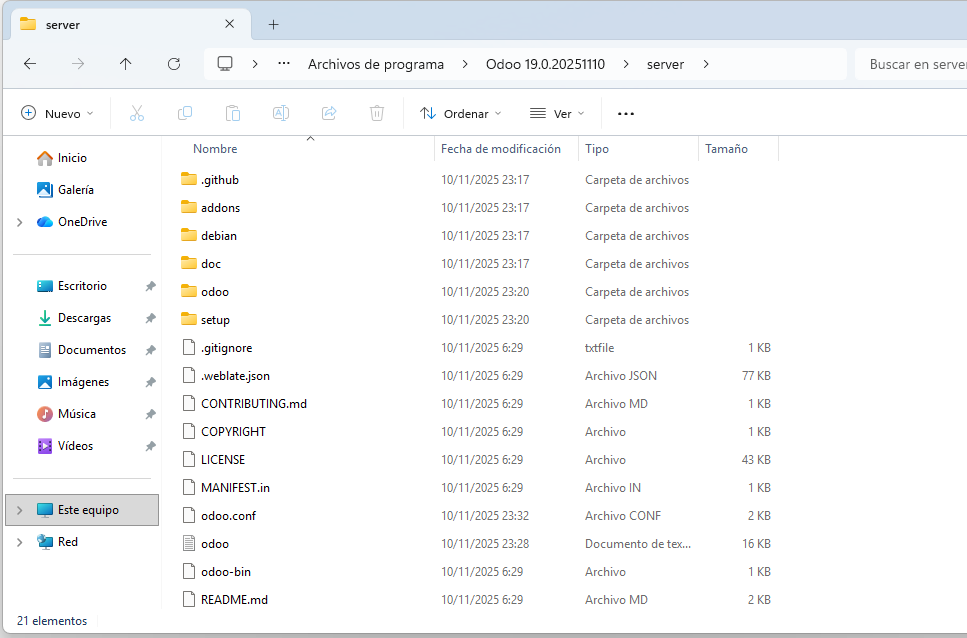

# 06 — Configuración inicial

En la ruta de instalación de Odoo (por defecto `C:\Program Files\Odoo 19.0\server\`) encontraremos el archivo de configuración `odoo.conf` donde podremos ver y modificar los parámetros básicos de Odoo.

> Parametro para cambiar el puerto de Odoo
> http_port = 8069 

Tambien encontraremos algunos parametros interesantes como la zona horaria, puerto de la base de datos, usuario y contraseña de PostgreSQL, etc.
