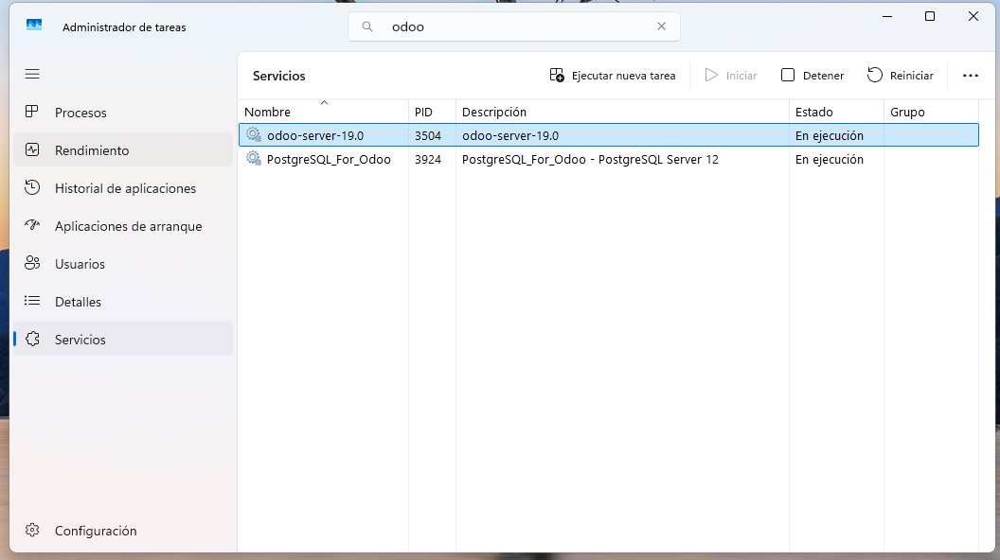

# 07 — Ejecución y servicio

Podemos buscar en el panel de busqueda de Windows "Servicios" y abrir la aplicación o sino desde el administrador (Ctrl + Shift + Esc) de tareas en la pestaña de "Servicios" y buscar "odoo".

Si el servicio está en ejecución aparecerá "En ejecución" en la columna de estado sino lo podemos arrancar manualmente.