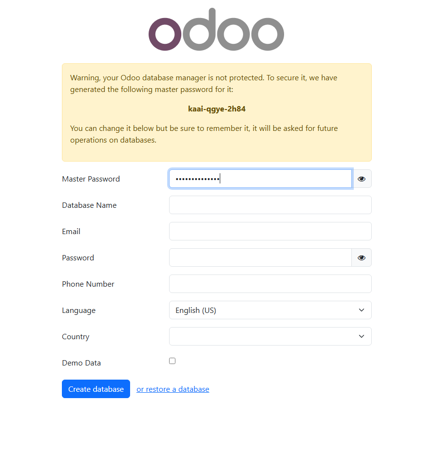

# 08 — Creación de base de datos de prueba

> Resultado esperado: BD de prueba creada y primer acceso.

Una vez instalado Odoo se nos abrira el navegador con la URL de acceso local que es 
- [localhost:8069](http://localhost:8069/)

Veremos el siguiente panel donde rellenaremos los datos
