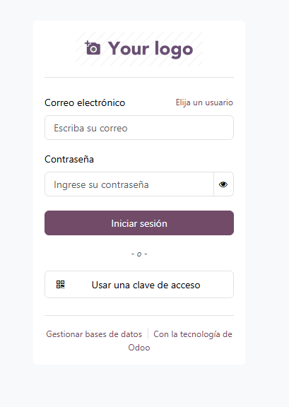
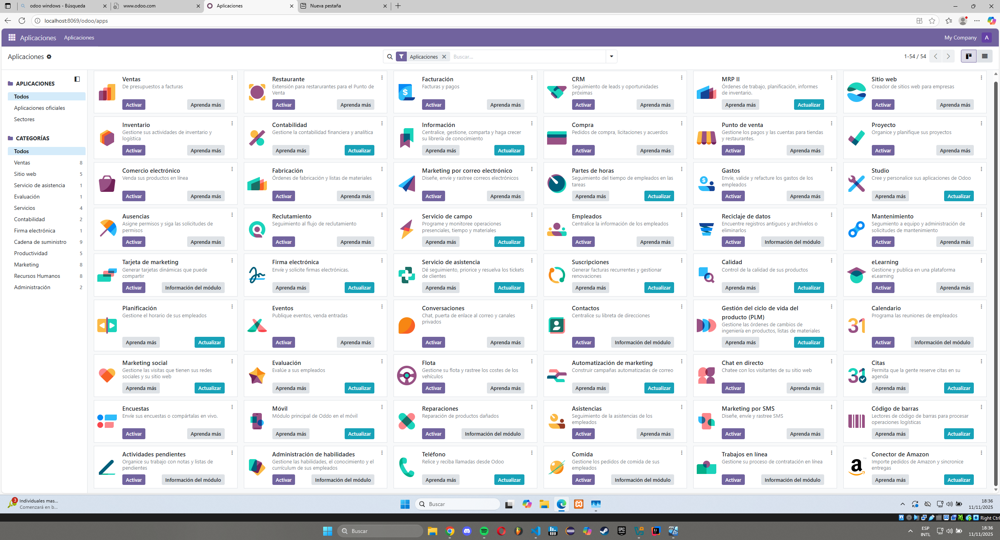

# 09 — Verificación de acceso

Una vez accedido a la url y creada la base de datos como vimos en los pasos anteriores, veremos el panel de login de Odoo donde introduciremos el usuario y la contraseña creados.

Después de iniciar sesión veremos el panel principal con acceso a instalar módulos y gestionar Odoo.
