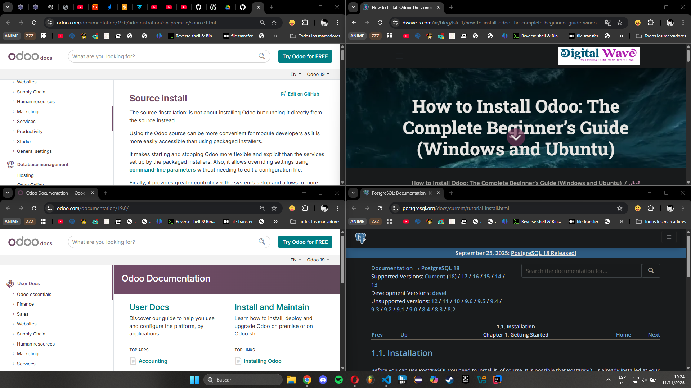

# 99 — Bibliografía y fuentes

- [Documentación oficial de Odoo (versión 19)](https://www.odoo.com/documentation/19.0/)
- [Guías de instalación en Windows de Odoo (sitio oficial)](https://www.odoo.com/documentation/19.0/administration/on_premise/source.html)
- [Documentación de PostgreSQL para Windows](https://www.postgresql.org/docs/current/tutorial-install.html)
- [Artículos técnicos (no comerciales) sobre instalación/servicio en Windows](https://www.dwave-s.com/ar/blog/lsfr-1/how-to-install-odoo-the-complete-beginners-guide-windows-and-ubuntu-1)

