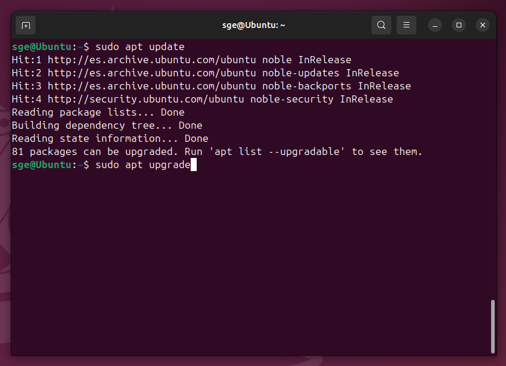

# 03 — Preparación del sistema

Actualizamos los indices y los paquetes de nuestro sistema con los siguientes comandos:
```bash
sudo apt update && sudo apt -y upgrade
```


Y para configurar la zona horaria e idioma podemos usar el siguiente comando:
```bash
sudo timedatectl set-timezone Europe/Madrid
```