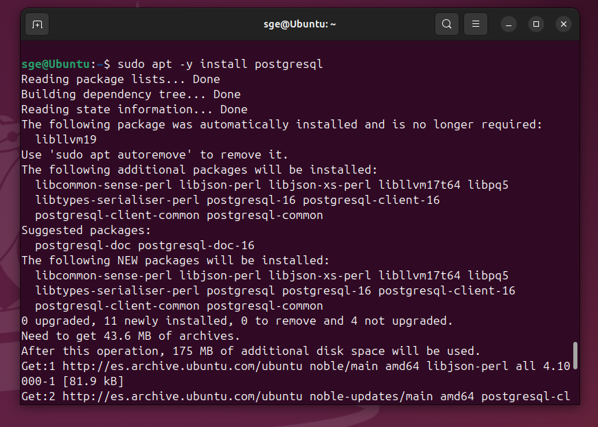

# 04 — PostgreSQL en Linux

Instalamos postgresql con el siguiente comando:
   ```bash
   sudo apt -y install postgresql
   ```




Cuando haya finalizado el comando anterior ejecutaremos el siguiente comando para verificar que el servicio de postgresql está en funcionamiento:
```bash
sudo systemctl status postgresql
```