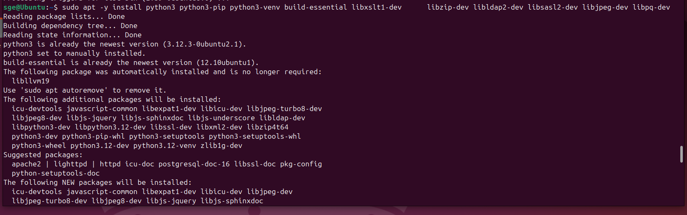
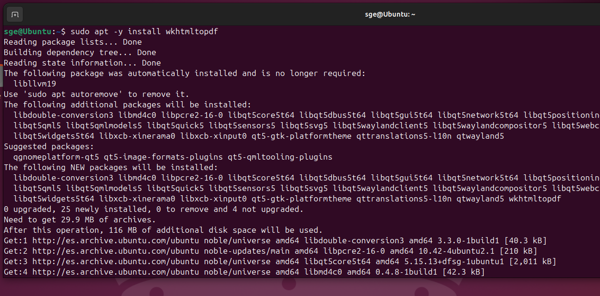
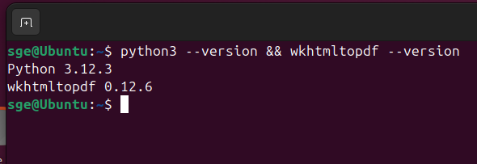

# 05 — Dependencias (Python, wkhtmltopdf, librerías)

1. Instala **wkhtmltopdf** compatible (para reportes PDF).

2. Verifica versiones:
   ```bash
   python3 --version
   wkhtmltopdf --version
   ```

> Resultado esperado: dependencias instaladas y comprobadas.

Instalamos python y paquetes de compilación necesarios:
   ```bash
   sudo apt -y install python3 python3-pip python3-venv build-essential libxslt1-dev      libzip-dev libldap2-dev libsasl2-dev libjpeg-dev libpq-dev
   ```



Instalamos wkhtmltopdf para reportes con pdf con el siguiente comando:
   ```bash
   sudo apt -y install wkhtmltopdf
   ```

   

Por último verificamos las versiones con:
   ```bash
   python3 --version
   wkhtmltopdf --version
   ```
   