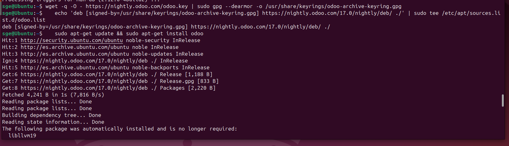

# 06 — Instalación de Odoo

Seguimos los pasos de la documentación oficial para instalar Odoo en Linux:
- [Documentación oficial de Odoo para instalación en Linux](https://www.odoo.com/documentation/17.0/es/administration/on_premise/packages.html#repository)

La cual nos indica que debemos ejecutar los siguientes comandos:
   ```bash
   wget -q -O - https://nightly.odoo.com/odoo.key | sudo gpg --dearmor -o /usr/share/keyrings/odoo-archive-keyring.gpg
   echo 'deb [signed-by=/usr/share/keyrings/odoo-archive-keyring.gpg] https://nightly.odoo.com/17.0/nightly/deb/ ./' | sudo tee /etc/apt/sources.list.d/odoo.list
   sudo apt-get update && sudo apt-get install odoo
   ```

   