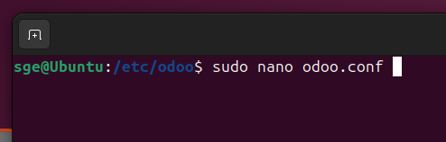

# 07 — Configuración de Odoo (`/etc/odoo/odoo.conf`)

Configuramos el archivo de configuración de odoo (`/etc/odoo/odoo.conf`) con los parámetros mínimos necesarios para su funcionamiento:


Y le ponemos el siguiente contenido:
   ```ini
   [options]
   db_host = False
   db_port = False
   db_user = odoo
   db_password = False
   addons_path = /opt/odoo/odoo-src/addons
   logfile = /var/log/odoo/odoo.log
   xmlrpc_port = 8069
   ```
Creamos la carpeta para los logs de odoo y le asignamos los permisos correspondientes:
   ```bash
   sudo mkdir -p /var/log/odoo && sudo chown odoo:odoo /var/log/odoo
   ```