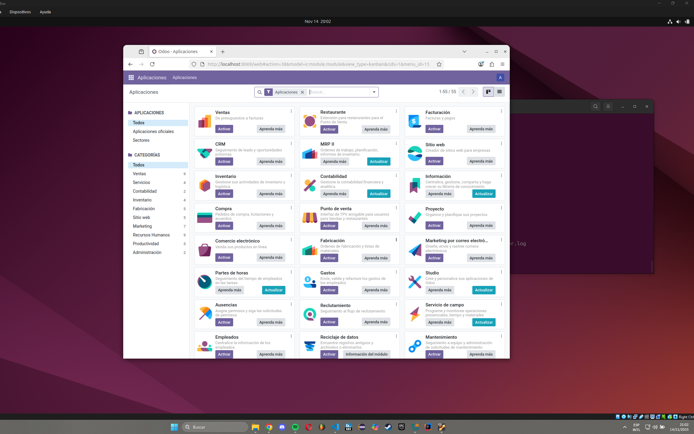

# 10 — Verificación de acceso

Accedemos a `http://localhost:8069` y verificamos que podemos entrar en el panel principal de Odoo con la base de datos creada anteriormente, proporcionando las credenciales del paso 09.

