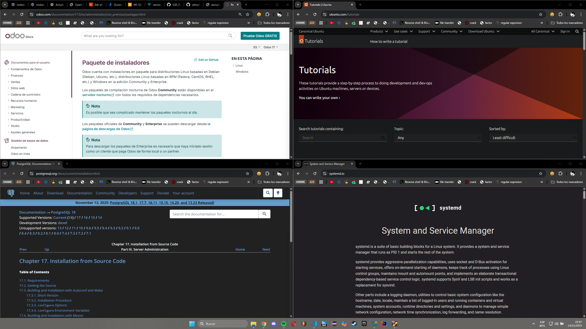

# 99 — Bibliografía y fuentes

Incluye aquí las fuentes usadas (oficiales y artículos técnicos). Ejemplos:
- [Documentación oficial de Odoo 17](https://www.odoo.com/documentation/17.0/es/administration/on_premise/packages.html)
- [Guías oficiales para Ubuntu/Debian](https://ubuntu.com/tutorials)
- [Documentación de PostgreSQL para Linux](https://www.postgresql.org/docs/current/installation.html)
- [Artículos técnicos (no comerciales) sobre systemd, wkhtmltopdf, etc.](https://systemd.io/)

